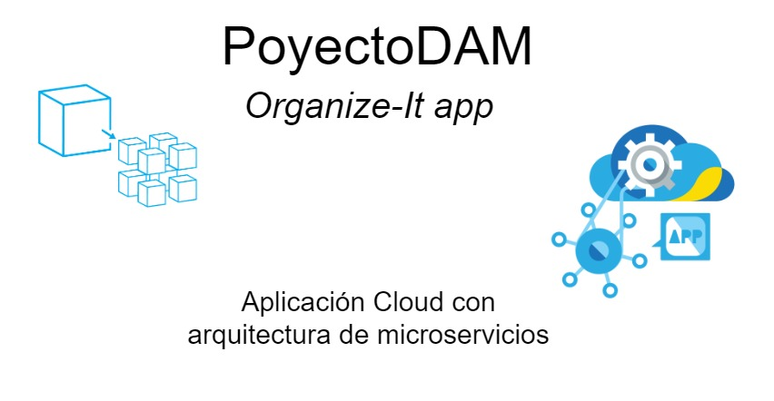

# ProyectoDam: Organize-It App

 
 
 

# Introducción

Este proyecto final para el grado DAM tratará el desarrollo de una aplicación con solución SaaS, la aplicación a su vez dará solución
a la organización de actividades permitiendo que varias personas se pongan de acuerdo de la forma más rápida y eficiente posible. 
Para el desarrollo del proyecto se utilizará una arquitectura basada en microservicios, siendo que la lógica de la aplicación será dividida
por funcionalidades que constituirán los distintos microservicios.

## Objetivo general
Ralizar un estudio del modelo de distribución de software SaaS basado en microservicios, identificando los componentes claves necesarios para
llegar a desplegar una aplicación basada en esta arquitectura.

 

## Objetivos específicos

<ul>
    <li>Conocer los principales componentes en una arquitectura de microservicios.
        <ul>
        <li>Microservicio</li>
        <li>Cloud Config.</li>
        <li>Service Discovery.</li>
        <li>Gateway.</li>
        </ul>
    </li>    
    <li>Codificación de la aplicación usando el modelo MVC y la arquitectura de microservicios.</li>
    <li>Desarrolo de una interfaz usando la biblioteca React</li>
    <li>Despliege de la aplicación en aws.</li>
</ul>

 
 

## Índice de contenido
> **[1- Tecnologías de desarollo.](./tecnologias/Tecnologias.md)**
>
> **[2- Entorno de desarrollo.](./entornoDesarrollo/EntornoDesarrollo.md)**
>
> **[3- Despliegue de la aplicación.](./despliegue/Despliegue.md)**
>
> **[4- Análisis de la aplicación.](./analisis/Analisis.md)**
>
> **[5- Diseño de la aplicación.](./diseño/Diseño.md)**
>
> **[6- Codificación del proyecto.](./codificacion/Codificacion.md)**
>
> **[7- Pruebas.](#8)**
>
> **[8- Detalles técnicos.](#9)**
>
> **[9- Problemas durante el desarrollo.](#10)**
>
> **[10- Mejoras posibles.](#11)**
>
> **[11- Conclusiones.](#12)**
>
> **[12- Bibliografia/Webgrafía.](#13)**
>
> **[Manual de Usuario](./manualUsuario/manualUsuario.md)**

 
 

