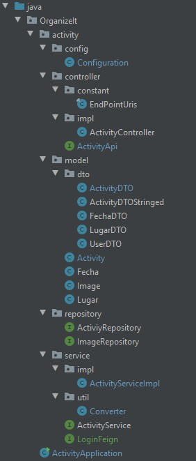

# Codificación del proyecto.

En este documento se va a tratar uno a uno los casos de uso de la aplicacón, acompañandolos del código más significativo que los implementa, y como se aplica en la
interfaz gráfica. Pero primero veamos como están construidos los microservicios para entender mejor el código:

 

### Microservicio Activity: 
Este microservicio se encarga de realizar las operaciones que tengan que ver con la **creación/modificación de actividades** y 
está organizado en las siguientes carpetas y clases: 

- **OrganizeIt**: Carpeta que contiene todo el proyecto.
  - **activity**: Carpeta que se usa para separar la clase ActivityApplication del resto del proyecto.
    - **config**
      - **Configuration**: Clase que define la configuración de beans.
    - **controller**
      - **constant**
        - **EndPointUris**: Clase en la que se definen las constantes que se van a usar para el mapeo de los puntos de entrada.
      - **impl**
        - **ActivityController**: Clase que implementa a la interfaz ActivityApi y define los métodos de esta.
      - **ActivityApi**: Interfaz en la que se definen los puntos de entrada a la aplicación.
    - **model**
      - **dto**
        - **ActivityDTO**: Clase que se usa para enviar información sobre una actividad a la interfaz.
        - **ActivityDTOStringed**: Objeto que se recibe desde la interfaz en el que todos los datos son de tipo primario.
        - **FechaDTO**: Clase que envia la interfaz cuando un usuario vota o propone una fecha.
        - **LugarDTO**: Clase que envia la interfaz cuando un usuario vota o propone un lugar.
        - **UserDTO**: Clase se recive desde el microservicio login.
      - **Activity**: Clase que se almacena en la base de datos.
      - **Fecha**: Clase que guarda una fecha junto a los votos de esta.
      - **Lugar**: Clase que guarda un lugar junto a los votos de este.
    - **repository**
      - **ActivityRepository**: Interfaz que extiende a MongoRepository y con la que se manejan los documentos de la clase activity.
    - **service**
      - **impl**
        - **ActivityServiceImpl** Clase que implementa a la interfaz ActivityService y define los métodos de esta.
      - **util**
        - **Converter**: Clase en la que se definen los métodos necesarios para la conversion entre clases. 
      - **ActivityService**: Interfaz que funciona entre el controlador y el repositorio encargandose de procesar los datos que viajan entre estas.
      - **LoginFeign**: Intefaz que define un cliente feign del microservicio login. En esta interfaz se declaran los métodos que vayan a ser necesarios para obtener información del microservicio login.
  - **ActiviyApplication**: Clase principal de la aplición, es la que inicia el programa.

 
 

### Microservicio Login: 
Este microservicio se encarga de realizar las operaciones que tengan que ver con la **creación/modificación de usuarios** y 
está organizado en las siguientes carpetas y clases: 

- **OrganizeIt**: Carpeta que contiene todo el proyecto.
  - **login**: Carpeta que se usa para separar la clase ActivityApplication del resto del proyecto.
    - **config**
      - **Configuration**: Clase que define la configuración de beans.
    - **controller**
      - **constant**
        - **EndPointUris**: Clase en la que se definen las constantes que se van a usar para el mapeo de los puntos de entrada.
      - **impl**
        - **LoginController**: Clase que implementa a la interfaz LoginApi y define los métodos de esta.
      - **LoginApi**: Interfaz en la que se definen los puntos de entrada a la aplicación.
    - **model**
      - **dto**
        - **UserDTO**: Clase se evía cuando se consume este microservicio.
      - **User**: Clase que se almacena en la base de datos.
    - **repository**
      - **LoginRepository**: Interfaz que extiende a MongoRepository y con la que se manejan los documentos de la clase User.
    - **service**
      - **impl**
        - **LoginServiceImpl** Clase que implementa a la interfaz LoginService y define los métodos de esta.
      - **util**
        - **Converter**: Clase en la que se definen los métodos necesarios para la conversion entre clases. 
      - **LoginService**: Interfaz que funciona entre el controlador y el repositorio encargandose de procesar los datos que viajan entre estas.
  - **LoginApplication**: Clase principal de la aplición, es la que inicia el programa.

 
 
 

## Caso de Uso: Crear actividad:

El usuario crea una actividad en la interfaz de react, la actividad es envida al microservicio **activity** que la almacena
en la base de datos de MongoDB.

### Interfaz de react.

#### ActivityApi.java

<code>@PostMapping("/new")
ResponseEntity newActivity (@RequestBody(required = false) ActivityDTOStringed activityDTOStringed);</code>

Se crea un punto de entrada en el que se recibirá un objeto ActivityDTOStringed y devolvera una respuesta http usando ResponseEntity.
Se usa la propiedad **requiered=false** para permitir objetos de la clase ActivityDTOStringed con el atributo id vacío.

### ActivityController.java

<code>public ResponseEntity newActivity(ActivityDTOStringed activityDTOStringed) {
        return as.newActivity(Converter.converActivityDtoStringedToActivity(activityDTOStringed));
    }</code>
    
El objeto ActivityDTOStringed que se recive, se convierte a un objeto de la clase Activity usando la clase Converter, y se pasa
a la clase ActivityService que devolverá un objeto ResponseEntity.

### ActivityService.java

<code>public ResponseEntity newActivity(Activity activity) {
    return ResponseEntity.ok(activiyRepository.insert(activity));
}</code>

