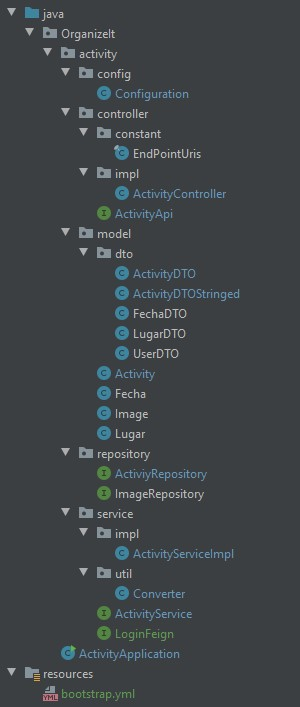

# Codificación del proyecto.

En este documento se va a tratar uno a uno los casos de uso de la aplicacón, acompañandolos del código más significativo que los implementa, y como se aplica en la
interfaz gráfica. Pero primero veamos como están construidos los microservicios para entender mejor el código:

### Microservicio Activity: 
Este microservicio se encarga de realizar las operaciones que tengan que ver con la creación/modificación de actividades y 
está organizado en las siguientes carpetas y clases: 

@PostMapping("/new")
ResponseEntity newActivity (@RequestBody(required = false) ActivityDTOStringed activityDTOStringed);</code>

Se crea un punto de entrada en el que se recibirá un objeto ActivityDTOStringed y devolvera una respuesta http usando ResponseEntity.
Se usa la propiedad **requiered=false** para permitir objetos de la clase ActivityDTOStringed con el atributo id vacío.

*ActivityController.java (implementa ActivityApi)*

<code>public ResponseEntity newActivity(ActivityDTOStringed activityDTOStringed) {
        return as.newActivity(Converter.converActivityDtoStringedToActivity(activityDTOStringed));
    }</code>
    
El objeto ActivityDTOStringed que se recive, se convierte a un objeto de la clase Activity usando la clase Converter, y se pasa
a la clase ActivityService que devolverá un objeto ResponseEntity.

