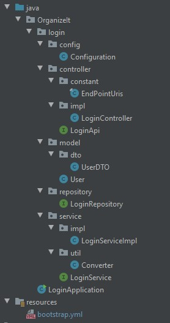
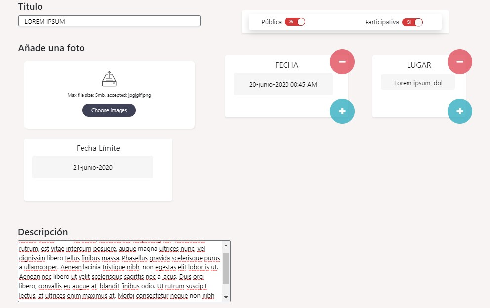

# Codificación del proyecto.

En este documento se va a tratar uno a uno los casos de uso de la aplicacón, acompañandolos del código más significativo que los implementa, y como se 
aplica en la interfaz gráfica. Pero primero veamos como están construidos los microservicios para entender mejor el código, comenzando con una explicación
genérica de las anotaciones que se usan en los microservicios y como se adapta el patrón MVC en ellos:

- **@Autowired**: Esta anotación declarada sobre una variable hará que Spring automaticamente la inicialize.
- **@ CrossOrigin(origins = "\*", allowedHeaders = "\*")**: con esta anotación se permite el intercambio de recursos de origen cruzado. 
- **@RequestMapping()**: Con RequestMapping asociamos la url definida entre los perentesis con el controlador donde se situe esta anotación.
                         si no se introduce ninguna url la dirección asociada será la dirección raiz (/).
- **@RestController**: Esta anotación convierte la clase en la que se use en un servicio REST.
- **@GetMapping()**: Esta anotación se usa para definir un controlador a peticiones de tipo GET que se hagan a la dirección definida entre los parentesis.
- **@PostMapping()**: Esta anotación se usa para definir un controlador a peticiones de tipo POST que se hagan a la dirección definida entre los parentesis.
- **@ Service**: Con esta anotación definimos un componente Service.
- **@Repository**: Con esta anotación definimos un comonente Repository
- **@RequestBody**: Con esta anotación definimos un objeto que esperamos recibir en el cuerpo de una peticion http.
- **@PathVariable()**: Con esta anotación definimos una variable que esperamos obtener en la url de una petición http.

Los microservicios activity y login están construido usando la misma estructura: 

Tienen 3 paquetes principales que son **controller**, **service** y **repository**. El paquete controller supondría el paquete que conocemos
como **Vista** en un patrón **MVC**, este paquete, o componente, es el que ofrece una interfaz para que los clientes interactuen con el
microservicio, es el encargado de recibir y responder peticiones. Por otro lado tenemos los paquetes **repository** y **model**, el **Modelo** de nuestra
aplicación, que será el responsable de aglomerar las clases que representan los datos que maneja el sistema (*model*), y el encargado de manejar
la persistencia de los datos(*repository*). Entre medias de estos dos componentes se encuentra el paquete **service**, nuestro **Controlador**, será el
encargado de la lógica de negocios actuando como intermediario entre el componente controller y repository.

El microservicio alert tiene una estructura similar, pero presciende del paquete controller ya que este no se comunica con otros microservicios directamente,
sino que ejecuta una serie de comprobaciones los datos cada 24 horas e interactúa únicamente con la base de datos.

Siguiendo con la explicación de como funcionan los microservicios, las peticiones son recibidas por una interfaz **NnombreApi** en la que se definen los 
endpoints usando las anotaciones **@RequestMapping**,**GetMapping** y **PostMapping**. Esta interfaz la implementa una clase **NombreController** 
(ambas dentro del paqute **controller**), que es definida como **componente controller** usando la anotación **@RestController**. 
Ejemplo de uno de los microservicios:  

 

***
ActivityApi
***

 
 
 
***
ActivityController
***

 
 

Las operaciones relacionadas con la base de datos se realizan usando una interfaz **NombreRepository** que extiende de **MongoRepository** y
declarada como **componente repository** usando la anotación **@Repository**. 
MongoRepository es una interfaz que nos permite realiazar múltiples operaciones con una base de datos MongoDB. Algunas de estas operaciones 
están ya definidase en MongoRepository y otras sólo tenemos que declararlas como métodos en nuestra interfaz *NombreRepository* utilizando palabras
claves que, Spring interpretará generando los métodos automaticamente. Un ejemplo sería para buscar cualquier objeto a partir de un atributo de su
clase, basta con definir un método tal que así: <code>Object findByAtributo(TipoAtributo valor)</code> y nos devolverá el primer objeto que encuentre
en la base de datos con un atributo que tenga el valor parametrizado. 
Ejemplo de uno de los microservicios: 

 
 

***
ActivityRepository
***

 
 

Por último, en el paquete service se crea la interfaz **NombreService** que implementa la clase **NombreServiceImpl** que es declarado como 
**componente service** usando la anotación **@Service** y es donde se desarrolla la logica de negocio del microservicio. 
Ejemplo de uno de los microservicios: 

 
 

***
ActivityService
***

 
 

### Microservicio Activity: 
Este microservicio se encarga de realizar las operaciones que tengan que ver con la **creación/modificación de actividades** y 
está organizado en las siguientes carpetas y clases: 

- **OrganizeIt**: Carpeta que contiene todo el proyecto.
  - **activity**: Carpeta que se usa para separar la clase ActivityApplication del resto del proyecto.
    - **config**
      - **Configuration**: Clase que define la configuración de beans.
    - **controller**
      - **constant**
        - **EndPointUris**: Clase en la que se definen las constantes que se van a usar para el mapeo de los puntos de entrada.
      - **impl**
        - **ActivityController**: Clase que implementa a la interfaz ActivityApi y define los métodos de esta.
      - **ActivityApi**: Interfaz en la que se definen los puntos de entrada a la aplicación.
    - **model**
      - **dto**
        - **ActivityDTO**: Clase que se usa para enviar información sobre una actividad a la interfaz.
        - **ActivityDTOStringed**: Objeto que se recibe desde la interfaz en el que todos los datos son de tipo primario.
        - **FechaDTO**: Clase que envia la interfaz cuando un usuario vota o propone una fecha.
        - **LugarDTO**: Clase que envia la interfaz cuando un usuario vota o propone un lugar.
        - **UserDTO**: Clase se recive desde el microservicio login.
      - **Activity**: Clase que se almacena en la base de datos.
      - **Fecha**: Clase que guarda una fecha junto a los votos de esta.
      - **Lugar**: Clase que guarda un lugar junto a los votos de este.
    - **repository**
      - **ActivityRepository**: Interfaz que extiende a MongoRepository y con la que se manejan los documentos de la clase activity.
    - **service**
      - **impl**
        - **ActivityServiceImpl** Clase que implementa a la interfaz ActivityService y define los métodos de esta.
      - **util**
        - **Converter**: Clase en la que se definen los métodos necesarios para la conversion entre clases. 
      - **ActivityService**: Interfaz que funciona entre el controlador y el repositorio encargandose de procesar los datos que viajan entre estas.
      - **LoginFeign**: Intefaz que define un cliente feign del microservicio login. En esta interfaz se declaran los métodos que vayan a ser necesarios para obtener información del microservicio login.
  - **ActiviyApplication**: Clase principal de la aplición, es la que inicia el programa.

 
 

### Microservicio Login: 
Este microservicio se encarga de realizar las operaciones que tengan que ver con la **creación/modificación de usuarios** y 
está organizado en las siguientes carpetas y clases: 

- **OrganizeIt**: Carpeta que contiene todo el proyecto.
  - **login**: Carpeta que se usa para separar la clase ActivityApplication del resto del proyecto.
    - **config**
      - **Configuration**: Clase que define la configuración de beans.
    - **controller**
      - **constant**
        - **EndPointUris**: Clase en la que se definen las constantes que se van a usar para el mapeo de los puntos de entrada.
      - **impl**
        - **LoginController**: Clase que implementa a la interfaz LoginApi y define los métodos de esta.
      - **LoginApi**: Interfaz en la que se definen los puntos de entrada a la aplicación.
    - **model**
      - **dto**
        - **UserDTO**: Clase se evía cuando se consume este microservicio.
      - **User**: Clase que se almacena en la base de datos.
    - **repository**
      - **LoginRepository**: Interfaz que extiende a MongoRepository y con la que se manejan los documentos de la clase User.
    - **service**
      - **impl**
        - **LoginServiceImpl** Clase que implementa a la interfaz LoginService y define los métodos de esta.
      - **util**
        - **Converter**: Clase en la que se definen los métodos necesarios para la conversion entre clases. 
      - **LoginService**: Interfaz que funciona entre el controlador y el repositorio encargandose de procesar los datos que viajan entre estas.
  - **LoginApplication**: Clase principal de la aplición, es la que inicia el programa.

 
 
 

## Caso de Uso: Crear actividad:

El usuario crea una actividad en la interfaz de react, la actividad es envida al microservicio **activity** que la almacena
en la base de datos de MongoDB.

### Interfaz de react.

#### ActivityApi.java

<code>@PostMapping("/new")
ResponseEntity newActivity (@RequestBody(required = false) ActivityDTOStringed activityDTOStringed);</code>

Se crea un punto de entrada en el que se recibirá un objeto ActivityDTOStringed y devolvera una respuesta http usando ResponseEntity.
Se usa la propiedad **requiered=false** para permitir objetos de la clase ActivityDTOStringed con el atributo id vacío.

### ActivityController.java

<code>public ResponseEntity newActivity(ActivityDTOStringed activityDTOStringed) {
        return as.newActivity(Converter.converActivityDtoStringedToActivity(activityDTOStringed));
    }</code>
    
El objeto ActivityDTOStringed que se recive, se convierte a un objeto de la clase Activity usando la clase Converter, y se pasa
al método **newActivity** de la clase ActivityService que devolverá un objeto ResponseEntity.

### ActivityServiceImpl.java

<code>public ResponseEntity newActivity(Activity activity) {
    return ResponseEntity.ok(activiyRepository.insert(activity));
}</code>

Se inserta el objeto en la base de datos usando la clase ActivityRepository, y se devuelve el resultado de esta operación encapsulado
en un objeto de ResponseEntity con un mensaje de estado Http 200.

 
 
 

## Caso de Uso: Ver actividades relacionadas a un usuario.

El sistema muestra al usuario una lista de actividades relacionadas con él, actividades a las que el usuario asista, haya sido invitado, o
de las que él sea creador. Para implementar esta funcionalidad, react realiza 3 peticiones al microservicio activity enviando el email
del usuario que está identificado en el sistema, cada una de estas peticiones tiene como respuesta las distintas listas de actividades
que la interfaz mostrará.

### Interfaz de react.

#### ActivityApi.java

<code>@GetMapping(EndPointUris.GetByUserInvited)
ResponseEntity<List<Activity>> getActivityByUserIsInvited (@PathVariable("email") String email);</code>

Crea un punto de entrada en el que el microservicio recibe el email de un usuario y devuelve una lista con las actividades en las que
ha sido invitado. El email que recibe lo pasa al método **findByUserIsInvited** de la la interfaz ActivityService que se encargará de devolver la lista de
actividades.

<code>@GetMapping(EndPointUris.GetByUserAssists)
ResponseEntity<List<Activity>> getActivityByUserAssist (@PathVariable("email") String email);</code>

Crea un punto de entrada en el que el microservicio recibe el email de un usuario y devuelve una lista con las actividades a las que
el usuario asiste. El email que recibe lo pasa al método **findByUserAssist** de la la interfaz ActivityService que se encargará de devolver la lista de
actividades.

<code>@GetMapping(EndPointUris.GetByUserIsCreator)
ResponseEntity<List<Activity>> getActivityByUserIsCreator (@PathVariable("email") String email);</code>

Crea un punto de entrada en el que el microservicio recibe el email de un usuario y devuelve una lista con las actividades en las que
el usuario es creador. El email que recibe lo pasa al método **findByUserIsCreator** de la la interfaz ActivityService que se encargará de devolver la lista de
actividades.

### ActivityServiceImpl.java

<code>public ResponseEntity<List<Activity>> findByUserAsisst(String email) {
   return ResponseEntity.ok(activiyRepository.findByUsuariosContaining(email));
}</code>

Usa la intefaz ActivityRepository para buscar en la base de datos las actividades que tengan el email recibido por parámetro en la lista
de usuarios que son asistentes, y devuelve el resultado de la operación encapsulado en un objeto de ResponseEntity con un mensaje de estado
Http 200.

<code>public ResponseEntity<List<Activity>> findByUserIsCreator(String email) {
    return ResponseEntity.ok(activiyRepository.findActivityByCreador(email));
}</code>

Usa la intefaz ActivityRepository para buscar en la base de datos las actividades en las que el email sea el valor del atributo creador,
y devuelve el resultado de la operación encapsulado en un objeto de ResponseEntity con un mensaje de estado
Http 200.

<code>public ResponseEntity<List<Activity>> findByUserIsIvited(String email) {
    return ResponseEntity.ok(activiyRepository.findByUsuariosInvitadosContaining(email));
}</code>

Usa la intefaz ActivityRepository para buscar en la base de datos las actividades que tengan el email recibido por parámetro en la lista
de usuarios que han sido invitados, y devuelve el resultado de la operación encapsulado en un objeto de ResponseEntity con un mensaje de estado
Http 200.

 
 
 

## Caso de Uso: Ver detalles de una actividad.

El usuario clica sobre la miniatura de una actividad, y el sistema muestra la actividad con todos sus datos. Para implementar esta funcionalidad
la interfaz envía al microservicio activity el id de la actividad que desea mostrar y este le devuelve los datos completos de la actividad.

### Interfaz de react.

 
 

#### ActivityApi.java

@GetMapping(EndPointUris.GetById)
ResponseEntity<ActivityDTO> getActivityById (@PathVariable("id") String id);

Se crea un punto de entrada al microservicio para recibir una petición con el id de una actividad, a esta petición se le responde devolviendo
un objeto ActivityDTO recuperado de la base de datos usando el id recibido. Para obtener el objeto ActivityDTO, se le pasa el id al 
método **getActivityById** que devolverá un objeto ActivityDTO.

### ActivityServiceImpl.java

<code>public ResponseEntity<ActivityDTO> getActivityById(String id) {
  Activity activityTmp = activiyRepository.findById(id).get();

  List<UserDTO> usersDTO = Arrays.asList(
    Objects.requireNonNull(loginFeign.getActivityUsers(activityTmp.getUsuarios())));

return ResponseEntity.ok(Converter.convertActivityToActivityDTO(activityTmp,usersDTO));
}</code>

Para recuperar la actividad de la base de datos, se usa la intefaz ActivityRepository con el método **findById**, que nos devolverá un objeto
Activity. Una vez tenemos el objeto de la clase Activity hay que convertirlo a ActivityDTO, para ello necesitamos una lista de objetos UserDTO.
Esta lista son los usuarios que asisten a la actividad, que, en la clase Activity se guarda tan sólo el email de los usuarios, pero la interfaz
necesita conocer también el nombre de cada uno. Para generar esta lista se llama al microservicio **login**, usando el endpoint **/user** y pasándole
el array con los emails de los usuarios, este devolverá un array con los objetos UserDTO que cree por cada email.
Para la llamada al microservicio se usa un cliente **feign**. Feign nos permite realizar llamadas a microservicios usando su id en lugar de
su dirección ip, para ello feign pregunta al servicio eureka por la dirección ip de un servicio con ese id, y este le devuelve la dirección
que tenga registrada.

El cliente feign se crea a partir de una interfaz y utilizando la anotación **@FeignClient()** y entre los paréntesis **name = 'id del servicio'**, y 
ya en el cuerpo de la interfaz se definen los métodos que se vayan a usar. Los métodos se definen especificando el endpoint con la anotación **@GetMapping**, **@PostMapping**,
o cual sea el tipo de petición http, y definiendo los parámetros y el objeto que retorna el método.

<code>@FeignClient(name = "login")
public interface LoginFeign {
    @GetMapping("/user")
    UserDTO[] getActivityUsers(@RequestBody List<String> users);
}</code>

El array que nos devuelve el microservicio login es transformado en un objeto List y por último se devuelve el resultado de convertir el objeto Activity
a ActivityDTO encapsulado en un objeto de ResponseEntity con un mensaje de estado Http 200.

 
 
 

## Caso de Uso: Buscar actividad.

El usuario introuce en la barra de búsqueda un título y pulsa en buscar. Al pulsar en buscar, react envía el texto introducido al microservicio activity,
que realiza una búsqueda de las activiades que contengan ese texto en su título para devolver una lista de actividades.

### Interfaz de react.

 

 
 

#### ActivityApi.java

<code>@GetMapping(EndPointUris.GET)
ResponseEntity<List<Activity>> getActivity (@PathVariable("title") String title);</code>

 

Se crea un punto de entrada en al microservicio para recibir una petición con un objeto String, a esta petición se le responde devolviendo
una lista de objetos Activity recuperando de la base de datos todas las actividades que contengan en su título el texto recibido.
Para obtener la lista de objetos Activity, se le pasa el texto al método **getActivity** del **service** que devolverá un objeto
ResponseEntity<List<Activity>>.

#### ActivityServiceImpl.java

<code>public ResponseEntity<List<Activity>> getActivity(String title) {
    return ResponseEntity.ok(activiyRepository.findActivityByTituloLike(title));
}</code>

El *service* recibe el texto y devuelve el resultado del método **findActivityByTituloLike** del **repository** encapsulado en un objeto de 
ResponseEntity con un mensaje de estado Http 200.  

 
 
 

## Caso de Uso: Apuntarse a la actividad

El usuario está viendo una actividad y pulsa en el boton "asistiré", react envía un string que contiene el id de la actividad y el email del usuario al
microservicio activity. El microservicio busca la actividad en la base de datos, añade el usuario a la lista de usuarios que asisten y reemplaza el
documento en MongoDB.

### Interfaz de react.

 

 
 

#### ActivityApi.java

<code>@PostMapping(EndPointUris.ADDUser)
ResponseEntity addUser(@RequestBody String data);</code>

Se crea un punto de entrada en el microservicio para recibir un objeto String que contiene un email de usuario y un id de actividad. Este String se
pasa al componente **service** que procesa el string.

#### ActivityServiceImpl.java

<code>public ResponseEntity addUser(String dataRequest) {
    try{
        String data = URLDecoder.decode(dataRequest,"UTF-8");
        String userEmail = data.substring(0,data.indexOf(","));
        String id = data.substring(data.indexOf(",")+1, data.length()-1);
     
        Activity tmpActivity = activiyRepository.findById(id).get();
        tmpActivity.getUsuarios().add(userEmail);
        activiyRepository.save(tmpActivity);
     
        return ResponseEntity.ok().build();
     
    }catch (Exception e){
        e.printStackTrace();
        return ResponseEntity.badRequest().build();
    }
}</code>

El **service** decodifica el String, que, al ser enviado en el body de una petición de tipo POST, necesita convertir el texto a UTF. Una vez 
decodificado separa el String usando el carácter ',' como indicador para diferenciar el id de la actividad del email del usuario. A continuación
obtiene un objeto Activity usando el método **findById** del componente **repository** y le añade el email a la lista de usuarios asistentes. Por
último utiliza el método **save** del **repository** para sobreescribir el documento que ha sido modificado y se devuelve un objeto ResponseEntity 
con mensaje de estado http 200.
Todo el bloque se ejecuta dentro de un try-catch porque el método de decodificación (*URLDecoder.decode()*) lanza una excepción que obliga a ser
capturada. En caso de que fallase, el microservicio devuelve un objeto ResponseEntity con mensaje de estado http 400. 

 
 
 

## Caso de Uso: Proponer fecha o lugar y Votar fecha o lugar.

El usuario está viendo una actividad y pulsa en los botones "fecha" o "lugar", react muestra las fechas o lugares y permite al usuario votar
o proponer nuevos valores. El usuario acepta los cambios y react envía un array de objetos FechaDTO o LugarDTO al microservicio activity.
Finalmente el microservicio comprueba si las fechas o lugares ya existen existen en la actividad, si existe suma un voto y si no lo añade
a la lista.

### Interfaz de react.

 

***
Votar o proponer fechas
***
 

 
 

***
Votar o proponer fechas
***
 

 
 

 
 

#### ActivityApi.java

<code>@PostMapping(EndPointUris.ADDDate)
ResponseEntity addDetail(@RequestBody FechaDTO[] fechasDTOList);
 
@PostMapping(EndPointUris.ADDPlace)
ResponseEntity addDetail(@RequestBody LugarDTO[] lugaresDTOList);</code>

Se crean dos puntos de entrada en el microservicio para recibir o bien una lista de lugares o una de fechas, y se pasan al service que sigue el
mismo procedimiento para cualquiera de los dos casos.

#### ActivityServiceImpl.java

<code>public ResponseEntity addDetail(FechaDTO[] fechasDTO) {
    List<FechaDTO> fechaDTO = Arrays.asList(fechasDTO);
 
    String id = fechaDTO.get(0).getActivityId();
    Activity tmpActivity = activiyRepository.findById(id).get();
 
    for(FechaDTO f : fechaDTO) {
        Fecha fecha = Converter.convertFechaDtoToFecha(f);
 
            if (tmpActivity.getFechas().contains(fecha)){
                int idx = tmpActivity.getFechas().indexOf(fecha);
            tmpActivity.getFechas().get(idx).setVotes(
                    tmpActivity.getFechas().get(idx).getVotes()+1);
 
        }else   tmpActivity.getFechas().add(fecha);
    }
 
        tmpActivity.getUsuariosParticipanFecha().add(fechaDTO.get(0).getUserEmail());
 
        return ResponseEntity.ok(activiyRepository.save(tmpActivity));
}
 
 
 
public ResponseEntity addDetail(LugarDTO[] lugaresDTOList) {
    List<LugarDTO> lugares = Arrays.asList(lugaresDTOList);
 
    String id = lugares.get(0).getActivityId();
    Activity tmpActivity = activiyRepository.findById(id).get();
 
    if(!lugares.get(0).getPlace().isEmpty()) {
        for (LugarDTO l : lugares) {
            Lugar lugar = Converter.convertLugarDtoToLugar(l);
 
            if (tmpActivity.getLugar().contains(lugar)) {
                int idx = tmpActivity.getLugar().indexOf(lugar);
 
                tmpActivity.getLugar().get(idx).setVotos(
                        tmpActivity.getLugar().get(idx).getVotos() + lugar.getVotos());
            } else tmpActivity.getLugar().add(lugar);
        }
    }
 
    tmpActivity.getUsuariosParticipanLugar().add(lugares.get(0).getUserEmail());
 
    activiyRepository.save(tmpActivity);
    return ResponseEntity.ok().build();
}</code

Los objetos DTO que recibe el service contienen el id de la actividad como uno de sus atributos, por lo que lo primero que hacemos es obtener ese id
para saber que actividad vamos a modificar y recuperarla de la base de datos. A continuación recorremos la lista de objetos FechaDTO o LugaresDTO
conviertiendo cada objeto su equivalente objeto Fecha o Lugar y comprobando si existe en la actividad recuperada. Si existe, se suma un voto a la
fecha o lugar, y si no existe, se añade con un voto. Por último se guarda el email del usuario en la lista de usuarios que han participado en la
actividad para que no pueda volver a realizar propuestas y se sobreescribe el documento orginal con el modificado, usando para ello el método
**save** del **repository**, y finalmente se devuelve un objeto ResponseEntity con mensaje de estado http 200. 

 
 
 

## Caso de Uso: Registrarse

El usuario solicita el registro de un nuevo usuario introduciendo un email, nombre y contraseña. React los envía al microservicio login, quien comprueba
si los datos son correctos y le da de alta.

### Interfaz de react.

 

 

 

 
 

#### LoginApi.java

<code>@PostMapping(EndPointUris.REGIST)
ResponseEntity registUser(@RequestBody User user);</code>

Se crea un punto de entrada en el microservicio login para recibir un objeto User, este objeto se pasa al service.

#### LoginServiceImpl.java

<code>public ResponseEntity<String> registUser(User user){
 
        if( (repository.findUserByEmail(user.getEmail())==null)){
 
            if( (repository.findUserByName(user.getName())==null)){
                repository.insert(user);
                return ResponseEntity.ok().build();
 
            }else return new ResponseEntity<>("name", HttpStatus.valueOf(403));
        }else return new ResponseEntity<>("email", HttpStatus.valueOf(403));
}</code>

El service comprueba que el email en el objeto User no se encuentre ya registrado en la base de datos, si no está registrado continua comprobando
que el nombre de usuario no esté registrado en el sistema, y si no está registrado, guarda el nuevo usuario en la base de datos usando el método
**insert** del componente **repository** y envía un objeto ResponseEntity con mensaje de estado http 200. 

Si el email está ya registrado, se envíaun objeto ResponseEntity con mensaje de estado http 403 y un texto "email" para indicar a react que el fallo
es por el email. 
Si el nombre está ya registrado, se envíaun objeto ResponseEntity con mensaje de estado http 403 y un texto "name" para indicar a react que el fallo
es por el nombre.

 
 
 

## Caso de Uso: Identificarse

El usuario introduce su nombre y contraseña y se identifica en el sistema. React envía los datos al microservicio login, que comprueba que los datos
sean correctos y envía una respuesta a react indicando si el usuario puede o no identificarse.

### Interfaz de react.

 

 

 

 
 

#### LoginApi.java

<code>@PostMapping(EndPointUris.LOGIN)
ResponseEntity validateUser(@RequestBody User user);</code>

Se crea un punto de entrada en el microservicio login para recibir un objeto User, este objeto se pasa al service.

#### LoginServiceImpl.java

<code>public ResponseEntity validateUser(User user) {
 
Optional<User> user1 = Optional.ofNullable(repository.findUserByName(user.getName()));
 
  if (user1.isPresent() && user1.get().getPassword().equals(user.getPassword())){
      return ResponseEntity.ok().build();
    }else return ResponseEntity.notFound().build();
}</code>

El service trata de recuperar de la base de datos el documento correspondiente al objeto User que recibe por parámetro usando el método **findUserByName**
del **componente repository** para buscar un usuario que tenga el mismo atributo name. Si lo encuentra, compara la contraseña que ha introducido el usuario
con la almacenada en la base de datos, y si son iguales, devuelve un objeto ResponseEntity con mensaje de estado http 200 que hará que react permita al
usuario identificarse en el sistema. Si por el contrario, no se encuentra nigun documento User con ese nombre, o las contraseñas no coinciden, se envía un
objeto ResponseEntity con mensaje de estado http 400 que hara que react deniegue el acceso al usuario.

