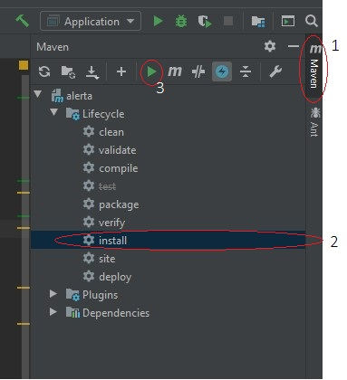
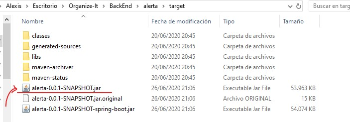
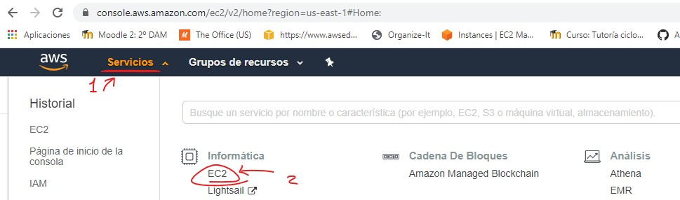
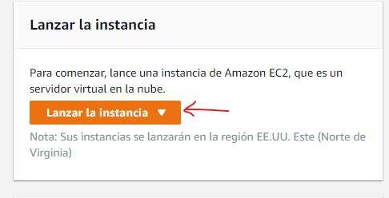
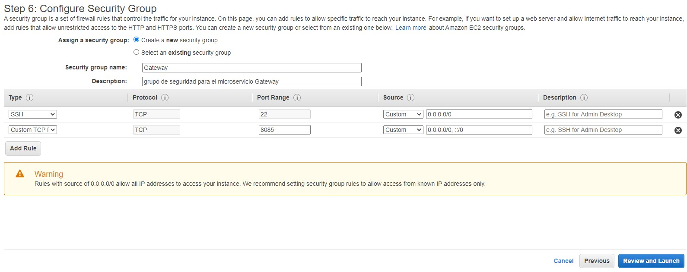
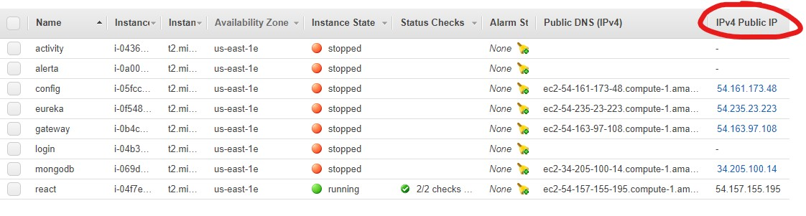
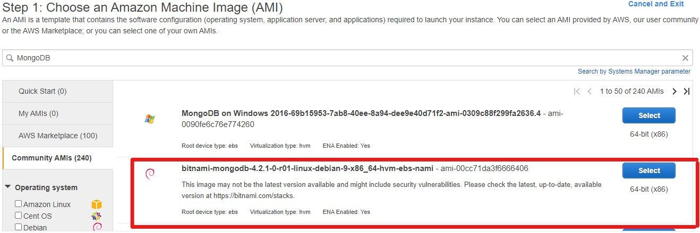

# Despliegue de la aplicación.

Tal y como se detalla en el apartado ***tecnologías a desarrollar***, el proyecto tiene como uno de sus objetivos realizar el
despliegue de la aplicación haciendo uso de los **amazon web services**, y es en este documento donde veremos como se ha llevado
a cabo ese proceso.
 

## Despliegue de los microservicios

Todos los microservicios han sido desplegados en instancias de ubuntu 18.04, a las que se le ha instalado el paquete **openjdk-8-jre-headless** 
con <code>sudo apt install openjdk-8-jdk</code>, a cada una de estas instancias se les ha transferido con SCP los ficheros jar construidos en Intellij.
Comenzemos viendo cómo crear estos ficheros jar, y a continuación pasaremos a ver cómo crear las instancias.

 
 

### Crear Jar.

Una vez hemos terminado de desarrollar un microservicio, el siguiente paso es compilarlo para crear el fichero JAR que nos permite realizar su ejecución
fuera del IDE.

En la parte derecha de IntelliJ podremos la ventana que se ve en la imagen, en la que se nos muestran varias operaciones a realizar con Maven. Si no
nos apareciera la ventana desplegada, para abrirla sólo hay que pulsar en el botón vertical que dice "**Maven**" (1).
A continuación, seleccionamos el item **install** (2), y por último clicamos sobre el botón ▶ que se encuentra más arriba (3).
 
Cuando finalice la creación del Jar, nos aparecerá en consola la dirección en la que se ha creado este fichero.

 
 

De forma que, nos dirigimos al directorio que se nos indica, y allí veremos el fichero Jar.

 
 

 
 
 

Una vez disponemos del jar, vamos a lanzar una instanca en **AWS** para hecer el despliegue del microservicio.

### Crear y lanzar instancia en AWS.

Cuando accedamos a la consola de AWS, nos dirigimos a la pestaña de servicios (1) y seleccionamos EC2 (2).

 
 

 
 

Nos redirigirá a una nueva ventana, si bajamos un poco veremos la opción **Lanzar la Instancia**.

 
 

 
 

Y si pulsamos ahí, nos iremos al asistente para la creación y lanzado de la instancia. En la barra de búsqueda (1) podremos buscar intancias que tengan ciertas características,
como por ejemplo que tenga instalada un SO Ubuntu. Pulsamos enter para realizar la búsqueda, y seleccionamos la que deseemos lanzar (2).

A continuación pasaremos por varias pantallas en las que podremos configurar diferentes aspectos de la instancia, como la memoria ram, el almacenamiento... Pulsaremos en
**next** dejando los valores por defecto hasta llegar a la ventana nº 6.

 
 

 
 

En esta pantalla podemos configurar las reglas que restringen el trafico de red. Para ello podemos crear un nuevo grupo de seguridad y configurarlo, o elegir uno que ya tengamos
creado. En este caso vamos a crear uno nuevo. Le damos un nombre al grupo de seguridad y una descripción, y para abrir los puertos que nos sean necesarios en esta instancia,
clicamos en **ADD Rule** y configuramos según nos sea necesario (protocolo, puerto, Ip de origen...).
 
 
Por último clicamos en **Review and Launch**, nos llevará a una ventana que resume toda la configuración de la instancia, y para lanzarla, pulsamos en **Launch**.

 
 
 

Podemos transferirlo a la instancia iniciada usando el comando <code>scp -i "clave" fichero.jar usuario@maquina:fichero</code>,
y se ha programado la ejecución de cada uno de los jar para que arranquen al mismo tiempo que se inicia la instancia. Para automatizar este proceso, se ha
creado un script llamado startapp.sh en la carpeta /etc/init.d/ con este codigo:  

<code>#!/bin/bash
java -jar 'direccion del fichero .jar'
</code>

 
Y una vez creado el script, se configura cron en la máquina para ejecutarlo al inicio. Esto se hace ejecutando 'crontab -e',
con esto podremos editar el fichero de configuración crontab. Para añadir el script y que se ejecute al iniciar la máquina
se añade una línea como la siguiente:
 

<code>@reboot /etc/init.d/startapp.sh</code>

Por último se modifican los permisos del script para que cron lo ejecute sin problemas.

<code>  sudo chmod +x /etc/init.d/startapp.sh</code>
 
 

### ¡IMPORTANTE!
Antes de intentar arrancar los microservicios, hay que configurar las dirección de los servidores eureka, config, y gateway. Amazon
otorga una dirección dinámica a las instancias, la cual podemos ver en una de las columnas que describe cada instancia.

 

 
 

Podemos cambiar las direcciónes que hayan en los ficheros de configuración de nuestro repositorio por esta dirección, o la dirección
dns que aparece a la izquierda. Hay que tener en cuenta que estas direcciones son dinamicas y cambian cada cierto tiempo, por lo que
esta opción sólo es válida para un entorno de pruebas, para poner la aplicación a funcionar definitivamente deberemos de usar
direcciónes que permanezcan estáticas, para ello podemos usar las direcciones Ip elásticas que ofrece amazon. Basta con crear una
nueva dirección Ip elástica y asociarla a la instancia que se desee.

Cabe mencionar que todas las instancias por defecto se lanzan en una misma red virtual, por lo que debería de poder usarse
la dirección ip privada para establecer las comunicaciones, pero tuve algunos problemas y no lo he podido comprobar. Si esta opción
fuese válida, bastaría con asignar unicamente una dirección Ip elástica a la instancia donde corre nuestra interfaz para que los
usuarios externos a la red puedan acceder sin problemas.

Por último, no debemos olvidarnos de configurar correctamente las reglas de seguridad de las instancias y abrir los puertos que
sean necesarios en cada caso.

 

## Despliegue de la interfaz en react.

Para desplegar la interfaz de react se ha usado el mismo tipo de instancia que para los microservicios, pero en lugar de instalar el
paquete de java, a esta se se le han instalado los paquetes ***curl***, y ***nodejs***. Para la instalación de *curl* se puede usar
apt-get, y para nodejs usamos este comando: 

<code>curl -sL https://deb.nodesource.com/setup_10.x | sudo bash -
sudo apt-get install -y nodejs</code>

Por último se crea la carpeta /var/www/app en la que se va a copiar la interfaz para su despliegue. Una vez creada la carpeta, se le
modifican los permisos <code>find /var/www/app -type d -exec sudo chmod 777 {} \ </code>, y para hacer la transferecnia de la aplicación
usamos rsync *(tambíen puede usarse scp, pero rsync es más rápido con ficheros pesados, y si lo que queremos es actualizar el proyecto, con
rsync se copiarán sólo los ficheros que hayan sufrido alguna modificación)*: 

<code>rsync -ravze "ssh -i ~/.ssh/clave.pem " --exclude '.git/' --exclude 'node_modules/' 'carpetaProyecto'/* 
usuario@maquina:/var/www/app</code>

Continuamos instalando las dependecias de la aplicación con <code>npm install</code>, y una vez finalizada la instalación, configuramos
el inicio automático de la aplicación al arranque de la instancia. El método es el mismo usado para los microservicios, la única diferencia
es el contenido del script, que pasará a ser este: 

<code>cd /var/www/app
npm start</code>

 

## Despliegue de MongoDB

Por último para el despliegue de MongoDB en aws se puede utilizar una de las instancias desarrolladas por la comunidad, a la que sólo habría que
configurar los puertos de entrada/salida.

 

 
 
