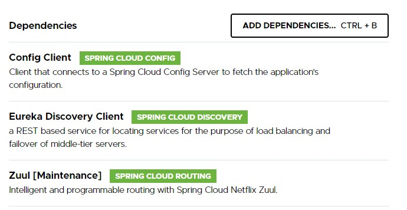

# Entorno de desarrollo

Para el desarrollo de la aplicación se ha usado el IDE Intellij + Maven y Java. Lo proyectos han sido creados en la página web
[**Spring Initializr**](https://start.spring.io/), que permite configurar un proyecto Maven con dependencias de
Spring deseadas. Al descargar el proyecto, se puede importar desde Intellij y ya tendríamos el proyecto listo
para comenzar a trabajar.
 

Detalle de versiones:

-  Spring Boot: 2.3.1
-  Maven: 3.6.1
-  Java: 1.8
-  IntelliJ IDEA: 2019.2.3 (Community Edition)
-  Sistema Operativo: Windows 10 Home.

 
 
 

## Veamos un ejemplo de cómo crear un proyecto usando Spring Initializr.

 
 

 
 
 
 

A la izquierda podemos ver los detalles que configuran el proyecto. Podemos cambiar el lenguaje ***(Java, Kotlin, o Groovy)***,
la versión de Spring Boot, y los metadatos del proyecto, que darán nombre a las carpetas que lo contienen.

A la derecha disponemos de un botón que al pulsarlo nos permite buscar y agregar dependencias al proyecto.

 

 
 

### A continuación pondré una captura con las dependencias usadas en cada microservicio:

 
 

 

*<h3>Activity</h3>*

 
 

 

*<h3>Login</h3>*

 
 

 

*<h3>Alert</h3>*

 
 

 

*<h3>Gateway</h3>*

 
 

 

*<h3>Eureka</h3>*

 
 

 

*<h3>Config</h3>*

 

 
Para el proyecto la única configuración destacable y necesaria, es la que permite a cada microservicio ir al config
server a buscar su configuración, allí definida, y en el caso del config server, la indicación del repositorio
que almacena los ficheros de configuración. Veamos cómo realizarlo:

 
 

## Configuración para los microservicios:

1. Primero se ha de crear el fichero bootstrap.yml y borrar el fichero application.properties en caso de que existiera.
2. En este fichero se indicarán 4 parámetros:
      
    - **name**: Este será el nombre que le daremos al microservicio, con este nombre, el config server será capaz de
        reconocer que fichero de configuración pertenece a cada uno de los microservicios que se conectan a él
        pues los ficheros de configuración deben llamarse con el nombre del microservicio, seguido de la extensión
        que se vaya a usar .yml, .yaml, .properties... Este nombre además será el Id con el que eureka registre
        al microservicio.
          
    - **label**: Indica la rama del repositorio en el que se encuentra el fichero de configuración del microservicio.
          
    - **uri**: Indica la dirección donde está funcionando el Service Config.
          
    - **fail-test**: Esta propiedad, si se indica como verdadera, hará que el microservicio no arranque si no es capaz
                 de obtener la configuración del Service Config.

#### Codigo usado en el proyecto:

<code>spring:
  application:
    name: alerta #Nombre que le daremos al microservicio.
  cloud:
    config:
      label: master
      uri: http://54.161.173.48:8888  #dirección dónde se encuentra el service config
      fail-fast: true             #con esta opción activada, el servidor no arrancará si no es capaz de leer la configuración
</code>

 
 

## Configuración para el config server:

1. Primero se ha de crear el fichero bootstrap.yml y borrar el fichero application.properties en caso de que existiera.
2. En este fichero se indicarán 10 parámetros, los mas destacables son los siguientes:
      
    - **name**: Nombre que daremos al microservicio.
          
    - **uri**: Indica la dirección del repositorio donde se encuentran los ficheros de configuración.
          
    - **fail-test**: Esta propiedad, si se indica como verdadera, hará que el microservicio no arranque si no es capaz
                 de obtener la configuración del Service Config.
          
    - **default-label**: Configura la rama por defecto del repositorio.

#### Codigo usado en el proyecto:

<code>server:
  port: 8888
spring:
  application:
    name: config
  cloud:
    config:
      server:
        git:
          uri: https://github.com/AlexisRuiz00/servercloudconfig.git
          force-pull: true
          clone-on-start: true
          default-label: master
          repos:
            local:
              uri: https://github.com/AlexisRuiz00/servercloudconfig.git
              force-pull: true
              clone-on-start: true
              default-label: master<code>

