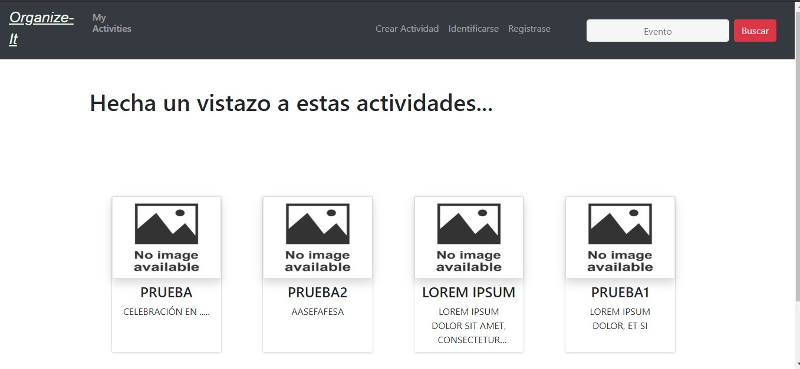
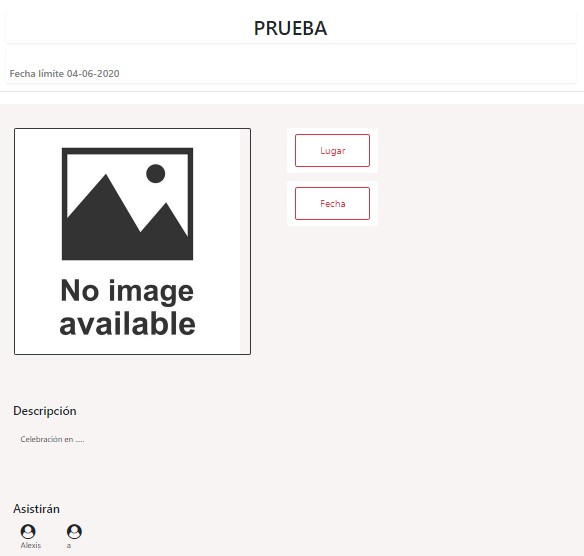

# Manual de usuario para el uso de Organize-It

>**[Página principal.]("#1")**
>
>**[Registrarse.]("#2")**
>
>**[Loguearse.]("#3")**
>
>**[Ver mis actividades.]("#4")**
>
>**[Buscar una actividad.]("#5")**
>
>**[Interactuar con las actividades.]("#6")**

 
 
 

## Página principal.

En la página principal, cuando se accede a la aplicación, se muestra una lista de actividades que han sido creadadas por los usuarios de la comunidad,
 si nos fijamos en la parte superior hay una barra de navegación que nos permite la movilidad entre las diferentes partes de la aplicación.
 
 
 

 

Si hacemos click sobre cualquiera de las actividades, podremos ver los detalles completos de la actividad, pero para apuntarse y realizar propuestas 
hay que estar registrado y loguearse en el sistema.

## Registrarse.

Usando esta página podemos darnos de alta en el sistema rellenando el formulario de registro y pulsando en **register**. Si los datos que se introducen
son correctos, es decir, que el email no se haya usado ya para darse de alta, y el nombre no esté en uso, el sistema da de alta un nuevo usuario, muestra
un mensaje informativo y lo redirige a la pantalla "MyActivities".

