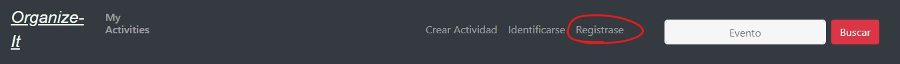
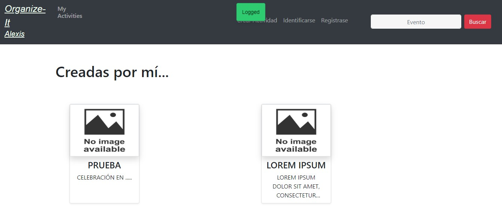
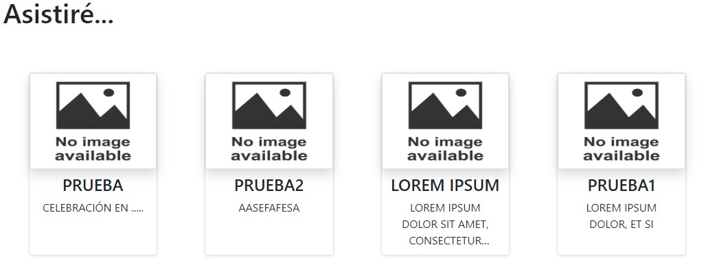

# Manual de usuario para el uso de Organize-It

>**[Página principal.](#1)**
>
>**[Registrarse.](#2)**
>
>**[Loguearse.](#3)**
>
>**[Ver mis actividades.](#4)**
>
>**[Buscar una actividad.](#5)**
>
>**[Interactuar con las actividades.](#6)**

 
 
 

## Página principal.

En la página principal, cuando se accede a la aplicación, se muestra una lista de actividades que han sido creadadas por los usuarios de la comunidad,
 si nos fijamos en la parte superior hay una barra de navegación que nos permite la movilidad entre las diferentes partes de la aplicación.
 
 
 

 

Si hacemos click sobre cualquiera de las actividades, podremos ver los detalles completos de la actividad, pero para apuntarse y realizar propuestas 
hay que estar registrado y loguearse en el sistema.

 
 
 
 
 
 
 
 
 
 
 

## Registrarse.

Pulsando sobre **'Registrase'** en la barra de navegación, podremos acceder a esta funcionalidad.

 

Usando esta página podemos darnos de alta en el sistema rellenando el formulario de registro y pulsando en **register**. Si los datos que se introducen
son correctos, es decir, que el email no se haya usado ya para darse de alta, y el nombre no esté en uso, el sistema da de alta un nuevo usuario, muestra
un mensaje informativo y lo redirige a la pantalla "MyActivities".

 
 
 

 
 
 
 
 
 
 
 
 
 
 

## Loguearse.

Pulsando sobre **'Identificarse'** en la barra de navegación, podremos acceder a esta funcionalidad.

 

Usando esta página podemos identificarnos en el sistema introduciendo nuestras credenciales y pulsando en **LOG IN**. Si los datos que se introducen
son correctos, el sistema al usuario, muestra un mensaje informativo y lo redirige a la pantalla "MyActivities".

 
 
 
 

 
 
 
 
 
 
 
 
 
 
 

## Ver mis actividades.

Pulsando sobre **'MyActivities'** en la barra de navegación, podremos acceder a esta funcionalidad si estamos logueados en el sistema, sino ser nos 
redirigirá hacia la pantalla de logueo.

 

En esta pantalla se muestran las actividades que ha creado el usuario, las actividades a las que el usuario se a apuntado como asistente, y las 
actividades privadas a las que han invitado al usuario.

 

 

 

