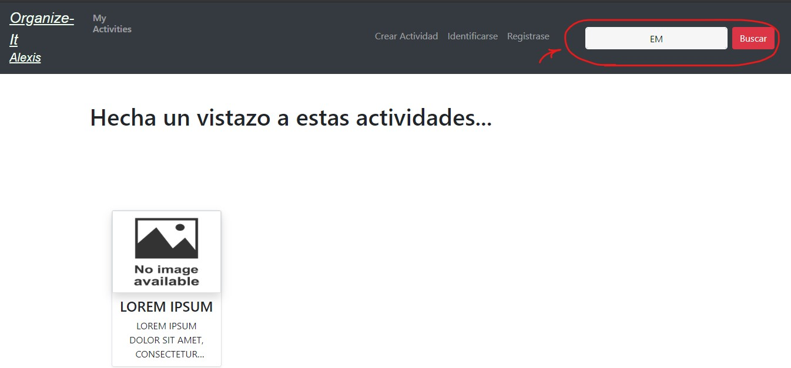
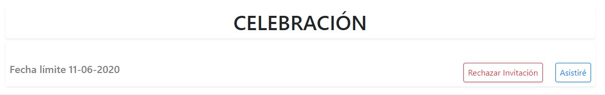

# Manual de usuario para el uso de Organize-It

>**[1.Página principal.](#1)**
>
>**[2.Registrarse.](#2)**
>
>**[3.Loguearse.](#3)**
>
>**[4.Ver mis actividades.](#4)**
>
>**[5.Buscar una actividad.](#5)**
>
>**[6.Crear una actividad.](#6)**
>
>**[7.Participar en una actividad.](#7)**

 
 
 

## 1. Página principal.

En la página principal, cuando se accede a la aplicación, se muestra una lista de actividades que han sido creadadas por los usuarios de la comunidad,
 si nos fijamos en la parte superior hay una barra de navegación que nos permite la movilidad entre las diferentes partes de la aplicación.
 
 
 

 

Si hacemos click sobre cualquiera de las actividades, podremos ver los detalles completos de la actividad, pero para apuntarse y realizar propuestas 
hay que estar registrado y loguearse en el sistema.

 
 
 
 
 
 
 
 
 
 
 

## 2. Registrarse.

Pulsando sobre **'Registrase'** en la barra de navegación, podremos acceder a esta funcionalidad.

 

Usando esta página podemos darnos de alta en el sistema rellenando el formulario de registro y pulsando en **register**. Si los datos que se introducen
son correctos, es decir, que el email no se haya usado ya para darse de alta, y el nombre no esté en uso, el sistema da de alta un nuevo usuario, muestra
un mensaje informativo y lo redirige a la pantalla "MyActivities".

 
 
 

 
 
 
 
 
 
 
 
 
 
 

## 3. Loguearse.

Pulsando sobre **'Identificarse'** en la barra de navegación, podremos acceder a esta funcionalidad.

 

Usando esta página podemos identificarnos en el sistema introduciendo nuestras credenciales y pulsando en **LOG IN**. Si los datos que se introducen
son correctos, el sistema al usuario, muestra un mensaje informativo y lo redirige a la pantalla "MyActivities".

 
 
 
 

 
 
 
 
 
 
 
 
 
 
 

## 4. Ver mis actividades.

Pulsando sobre **'MyActivities'** en la barra de navegación, podremos acceder a esta funcionalidad si estamos logueados en el sistema, sino ser nos 
redirigirá hacia la pantalla de logueo.

 

En esta pantalla se muestra en varias listas las actividades que ha creado el usuario, las actividades a las que el usuario se a apuntado como asistente, 
y las actividades privadas a las que han invitado al usuario.

 

 

 

 
 
 
 
 
 
 
 
 
 
 

## 5. Buscar una actividad.

En la barra de navegación hay un recuadro de texo en el que podemos escribir para buscar actividades por su título. Cuando se pulse en "buscar", 
se presentará una lista con actividades que contengan el texto introducido en su título.

 

 

 
 
 
 
 
 
 
 
 
 
 

## 6. Crear una actividad.

Pulsando sobre **'Crear Actividad'** en la barra de navegación, podremos acceder a esta funcionalidad que nos permite crear nuevas actividades, pero 
para ello debemos estar identicados en el sistema, sino se nos redirigirá a la pantalla de login para que nos identifiquemos.

 

 

 

En esta ventana podemos crear nuevas actividades y configurarlas a nuestro gusto.

 

 

 

Para crear una nueva actividad debemos introducir unos detalles mínimos:
 - **Título**: Título que da nombre a la actividad.
 - **Descripción**: Un texto que explique el proposito de la actividad.
 - **Fecha Límite**: A partir de esta fecha no se podrán realizar mas votaciones ni propuestas de lugares y fechas. 
                     Cuando se alcanze este día, se enviará un email a todos los asistentes indicando la fecha y lugar 
                     donde tendrá lugar el evento ya han sido fijados.
 - **Fecha**: El creador debe añadir mínimo una posible fecha en la que se realizará el evento.
 - **Lugar**: El creador debe añadir mínimo un posible lugar en la que se realizará el evento. 
 - **Participativa**: Si la actividad se marca como participativa, lo usuarios asistentes podrán proponer nuevas fechas y lugares, 
                      hasta un máximo de 2 por usuario asistente. La cantidad de fechas y lugares que puede proponer el creador 
                      variará dependiendo de si es participativa o no. Si lo es, el creador tendrá un límite de 3 fechas y lugares, y 
                      sino, el usuario tendrá un máximo de 5.
 - **Pública**: Si la actividad se marca como pública, cualquier usuario podrá verla buscandola o desde la pantalla principal, y podrá 
               apuntarse como asistente. Si se marca como no pública, se mostrará al creador una opción para que añada nombre usuarios, 
               a estos usuarios les aparecerá la actividad en la lista de invitaciones y podrán verla y apuntarse si lo desean. 
 
Otros detalles:
 - **Imágen**: El creador puede añadir una imagen que se muestre en el cuerpo de la actividad, si no añade nada, se mostrará una imagen por 
               defecto.

 
 

### Añadir fechas

Para añadir nuevas fechas cuando se está creando una actividad, hay que usar el buscador de fechas, que al pulsar sobre él nos mostrará un calendario 
para que seleccionemos la fecha deseada.

 

Cuando seleccionemos una fecha, tendremos que pulsar en el botón azúl con el símbolo **(\+)** para que se añada a la actividad. Si queremos eliminar una 
fecha, lo podemos hacer pulsando el botón rojo con el símbolo **(\-)**, con este eliminaremos la fecha que se encuentre más abajo de la lista.

***
Fecha no añadida a la actividad
***

 
 
 
***
Fecha añadida a la actividad
***

 
 

### Añadir lugares.

Para añadir nuevos lugares cuando se está creando una actividad, hay que usar el buscador de lugares. El buscador de lugares sugiere posible lugares conforme 
se va introduciendo texto, pero no es obligatorio seleccionar ninguna de las sugerencias, se puede introducir un texto cualquiera para definir el lugar.

 

Cuando seleccionemos un lugar, tendremos que pulsar en el botón azúl con el símbolo **(\+)** para que se añada a la actividad. Si queremos eliminar un 
lugar, lo podemos hacer pulsando el botón rojo con el símbolo **(\-)**, con este eliminaremos el lugar que se encuentre más abajo de la lista.

***
Lugar no añadido a la actividad
***

 
 
 
***
Lugar añadido a la actividad
***

 
 

### Invitar usuarios a una actividad privada.

Cuando marcamos una actividad como no pública, aparece al lado un icono que al pulsarlo nos abre una ventana en la que podremos introducir el nombre
de los usuarios a los que queramos invitar y añadirlos a la lista de invitación.

***
Actividad marcada como pública
***

 
 
 
***
Actividad marcada como privada
***

 
 
 
***
Lista de usuarios invitados
***

 

Para añadir nuevos usuarios a la lista de invitación, introduce su nombre en el cuadro de texto, y si existe un usuario con ese nombre, será agregado 
a la lista. Si lo que queremos es eliminar usuarios de la lísta, basta con pulsar el botón rojo con el símbolo **(x)** que aparece a la derecha de cada uno.

 
 
 
 
 
 
 
 
 
 
 

## 7. Participar en una actividad.

Cuando estamos viendo los detalles de una actividad, podremos votar y realizar proupestas de fechas y lugares, siempre y cuando seamos asistentes de la
actividad. Para asistir a una actividad basta con marcar el botón **Asistiré** que aparece bajo el título de la actividad.

 

 

En este caso, aparece otra opción que es la de **Rechazar Invitación**, esto es porque se trata de una actividad privada a la que nos han ivitado, si 
queremos rechazar la invitación para que no nos apareca más en nuestra lista de invitaciones, basta con pulsar ahí.

 
 

***
Si la actividad es pública no nos aparecerá esa opción de rechazar.
***

 
 
 

 
 
Si deseamos dejar de ser asistentes de la actividad, podemos hacerlo pulsando en **No Asistiré**.
 
 
Una vez que somos asistentes de la actividad, para votar y proponer nuevas fechas o lugares, dependerá de si la actividad es participativa o no,  
esto lo habrá decidido el usuario al crearla. Si es participativa podremos votar y proponer, y si no, sólo podremos votar los lugares que el creador 
haya propuesto. 

### Votar y proponer lugares.
Para realizar estas acciones pulsamos en el botón **Lugar**, que nos mostrará los lugares que se hayan propuesto. Al lado de cada lugar tenemos un botón 
verde, si pulsamos este botón se añadira un voto a ese lugar, y aparecerá un botón rojo que nos permitirá quitarle el voto. 
Arriba del todo hay un recuadro de texto que nos permitirá proponer un lugar.

 

 
 
 

