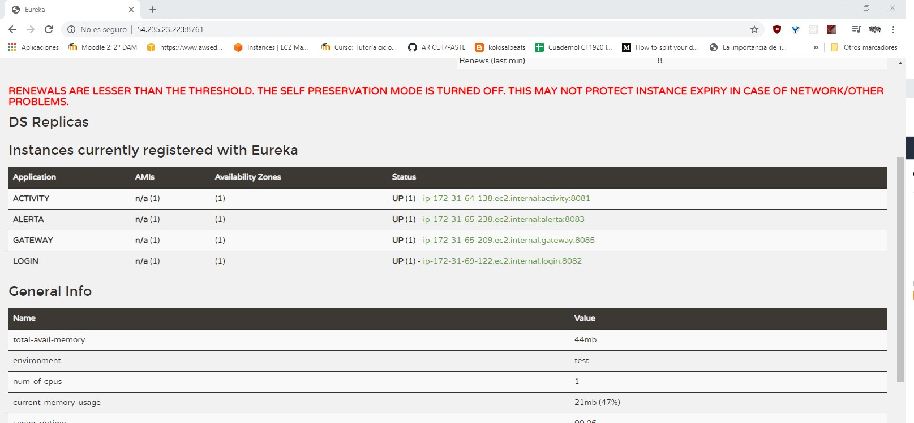

# Pruebas del funcionamiento de la App

Para testear el funcionamiento de los microservicios se ha usado Postman y el navegador Chrome, veamos algunas de las pruebas realizadas:

 

## Microservicio Eureka
El servicio Eureka tiene una interfaz web en la que podemos ver y comprobar que el servicio está activo y cumple su función registrando
los servicios que se comunican con él. Para acceder a esta interfaz, introducimos la dirección del microservicio más el puerto en el que 
está funcionando y nos aparecerá tal que así:

 

 

Por último, en este [enlace](https://www.youtube.com/watch?v=AhxCwrT0Ejw&feature=youtu.be) se puede ver un videotutorial en el que se explica cómo funciona la aplicación y se puede ver como funciona estando desplegada.
