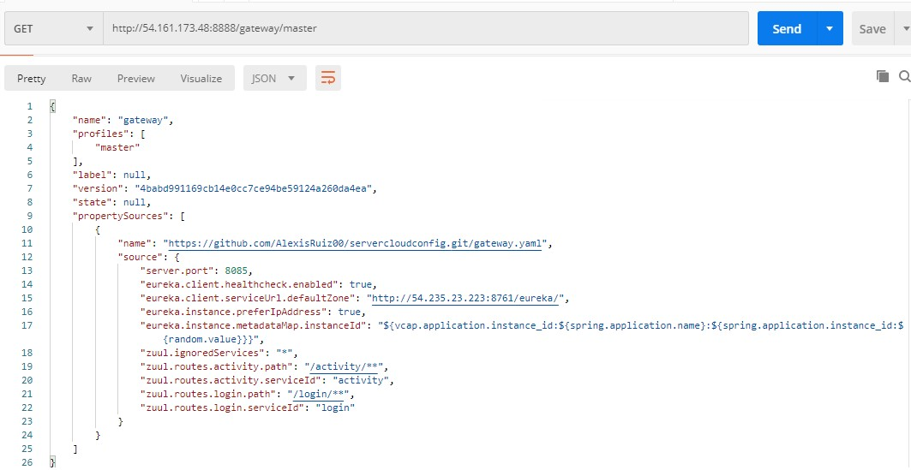
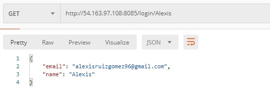
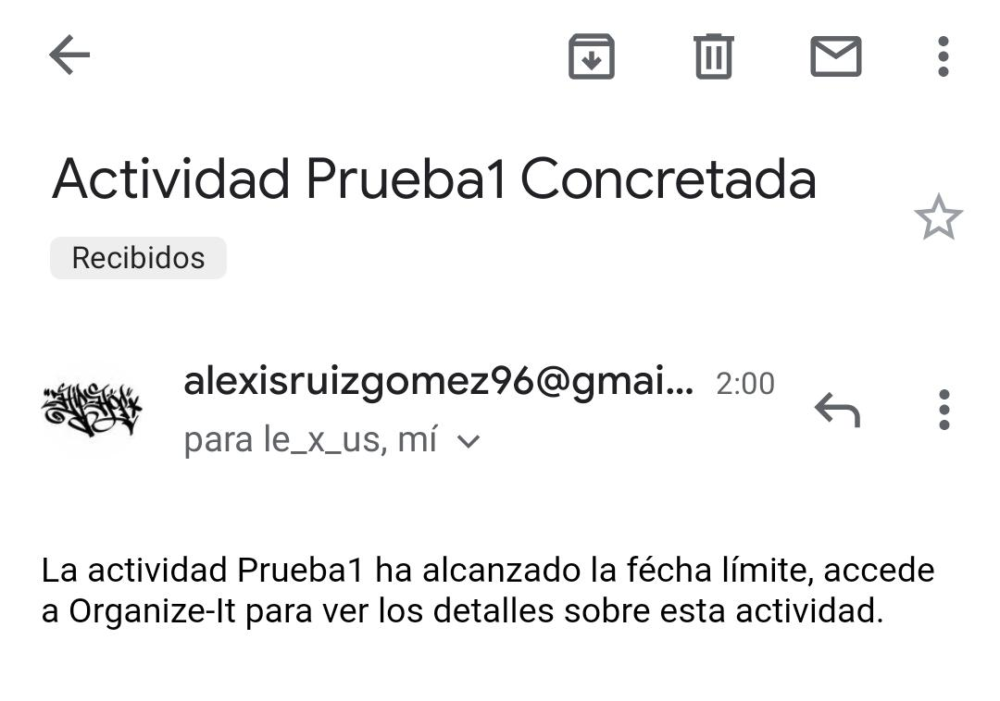

# Pruebas del funcionamiento de la App

Para testear el funcionamiento de los microservicios se ha usado Postman y el navegador Chrome, veamos algunas de las pruebas realizadas:

 

## Microservicio Eureka.
El servicio Eureka tiene una interfaz web en la que podemos ver y comprobar que el servicio está activo y cumple su función registrando
los servicios que se comunican con él. Para acceder a esta interfaz, introducimos la dirección del microservicio más el puerto en el que 
está funcionando y nos aparecerá tal que así:

 

 
 
 

## Microservicio Cloud Config.
El microservicio Cloud Config ofrece unos endpoints, que son los mismos que consumen los microservicios cuando tratan de obtener su configuración,
y serán los que se usarán para comprobar su funcionamiento. Los endpoints se forman añadiendo a la dirección del microservicio, el nombre de uno
de los perfiles de configuración que hay en el repositorio más la rama del repositorio.

 

 
 
En este ejemplo se ha hecho una petición al perfíl del microservicio gateway y se puede ver cómo el Cloud Config nos devuelve un documento con la
configuración.

 

## Microservicio Gateway
El microservicio gateway nos redirige las peticiones al microservicio que le indiquemos, así que, comprobando que nos redirija a cada uno de los
microservicios obteniendo una respuesta, comprobaremos que los microservicios a los que nos redirije funcionan. Para hacer las peticiones usamos
la dirección del Gateway añadiendole /'path'/'endpoint del microservicio'. El path de la dirección se configura en el archivo de configuración del
gateway, se puede ver en la imagen de arriba.

### Microservicio Activity
 

 
 

### Microservicio Login
 

 
 

## Alert
El microservicio Alert no tiene ningun punto de entrada, así que para comprobar su funcionamiento, que es el de comprobar qué actividades han de terminar
y enviar un correo electrónico, he creado una actividad y he esperado a que llegue un correo que confirme su funcionamiento.

### Microservicio Activity
 

 
 

Por último, en este [enlace](https://www.youtube.com/watch?v=AhxCwrT0Ejw&feature=youtu.be) se puede ver un videotutorial en el que se explica cómo funciona la aplicación y se puede ver como funciona estando desplegada.
