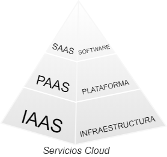
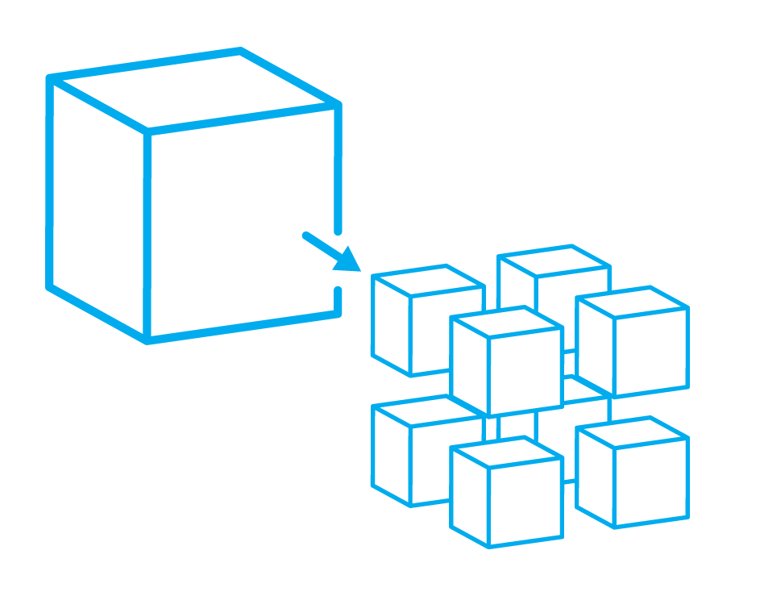
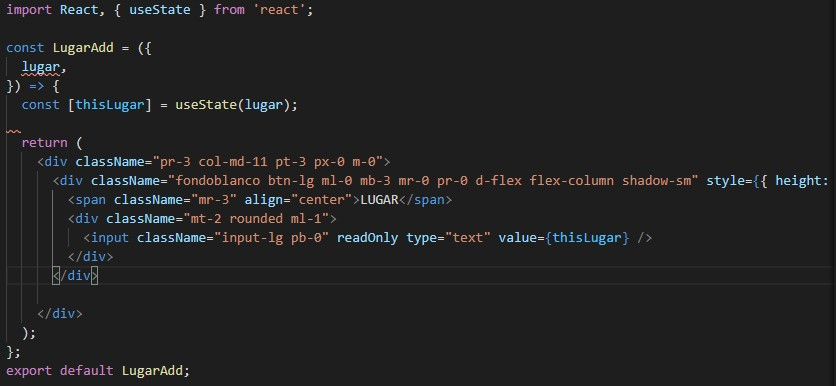
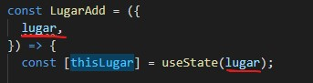
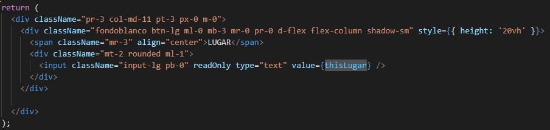
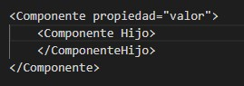
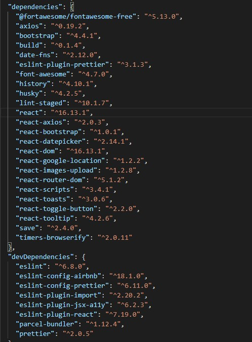
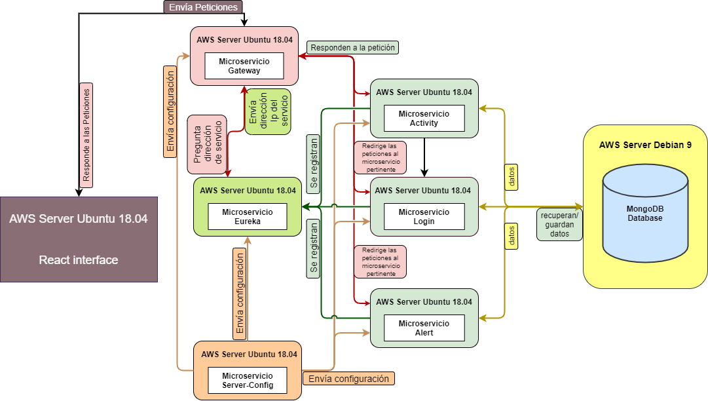

# Tecnologías de desarrollo

*A continuación se describen las tecnologías que han sido usadas para el desarrollo y despliegue de la aplicación.*

 
 

## Cloud Services

Uno de los objetivos de este proyecto, es el de desplegar la aplición como SaaS *(Software como servicio)*, como se puede 
  ver en la figura a la derecha, SaaS forma parte de un conjunto de servicios llamados Servicios cloud, estos servicios 
 han cambiado la forma de entender tanto la gestión como el acceso a los recursos informáticos, pues con ellos hemos  
 dejado atrás un modelo en el que la única manera de obtener estos recursos era adquiriéndolos fisicamente y hacesrse 
 cargo de su instalación y mantenimiento.

Con la aparición de los <b>cloud services</b> el escenario a dado un giro al consumo bajo demanda dónde los recursos  
 son consumidos como servicios. El usuario final se desentiende totalmente del mantenimiento y se limíta al uso y 
 consumo, volviendose algo intangible para el usuario, que no conoce, ni necesita conocer, la localización física 
 de estos recursos (si fuese hardware), o la máquina en la que se está ejecutando (si fuese software).

 
 
Veamos ahora cómo se aplicará esta tecnología al desarrollo y puesta en producción del proyecto:
 
 

### SaaS

<b>SaaS</b> por tanto es un modelo de distribución de software en el que se ofrece al usuario un servicio disponible desde  
 cualquier dispositivo, pues al estar alojado en la nube sólo se necesita conexión a internet para acceder a este. Este modelo 
 de distribución es el que se usará para el despliegue de la aplicación.

 
 

### Gitab

Gitlab es un **PaaS** *(Plataforma como servicio)* que nos permite hacer control de versiones de un proyecto de desarrollo, en este 
servicio es donde se alojarán el código, y la documentación de la aplicación.

 
 
 

### AWS

**Amazon Web Services** es una colección de servicios que ofrece amazon, será la plataforma que se usará para desplegar los microservicios
de la aplicación. Concretamente se usará un servicio de los que ofrece esta plataforma, llamado EC2, este servicio permite alquilar maquinas
virtuales *(IaaS)* con unos recursos personalizables y en las que tenemos un control total sobre el sistema. En el apartado [despliegue](depliegue/Despliegue.md)
se explica paso a paso cómo se han usado estos servicios para hacer el despliuegue de la aplicación.

 
 

## Microservicios:

Es una arquitectura para el desarrollo del software, en la que una aplicación es formada por distintos servicios
independientes que se despliegan según se vayan necesitando. Con este tipo de arquitectura conseguimos una 
alta escalabilidad y una gran facilidad para la ampliación de funcionalidades, pues al estar la aplicación
compuesta por pequeños servicios que se comunican entre ellos, para añadir uno nuevo, no es necesario detener
nada.

A la hora de desplegar una arquitectura de estas características, surgen ciertas problemáticas por la naturaleza
descentralizada de la mismsa. Para dar solución a estos problemas, surgen los siguientes componentes o servicios, que
deberemos de añadir a nuestra aplicación:

  - Cloud Config:
     
        Este servicio nos permitirá centralizar la configuración de todos los servicios en un único repositorio, de esta  
         forma nuestra aplicación será facilmente parametrizable e incluso podremos realizar cambios en caliente. 

  - Service Discovery: 
     
        La arquitectura de microservicios se basa en que cada servicio consuma de otros microservicios, cada uno 
         con un número n de instancias desplegadas. Esto significa que un microservicio no puede tener configurado 
         una dirección estática indicando en que dirección están los otros microservicios que va a consumir, pues 
         cada microservicio va a tener numerosas instancias funcionando con distintas direcciones.
     
     
        Para solucionar este problema se usa el Service Discovery, este servidor almacena las direcciones de cada 
         instancia conforme se van desplegando y registra el id del servicio al que pertenecen. De esta forma, cada 
         microservicio sólo necesita conocer los id de los microservicios que vaya a consumir y la dirección del 
         service discovery, cuando vayan a realizar una comunicación con otro servicio, preguntarán al 
         service discovery por la dirección de *x* id y este les devolverá una dirección que en ese 
         momento esté siendo usada por el servicio en cuestión.
        
  - Gateway:
     
        Con este definiremos un único punto de entrada a nuestra aplicación, que se encargará de enrutar 
         las peticiones externas hacia el microservicio pertinente y de devolver las respuestas.

Al mismo tiempo, esta descentralización tiene unas ventajas que con una arquitectura monolítica serían imposibles de 
conseguir:

  - Tolerancia a fallos: El tener la posibilidad de desplegar varias instancias por cada microervicio hace sea 
                         muy poco probable que se caigan todas, esto junto a una buena configuracion que redirija 
                         las peticiones cuando no haya respuesta, nos da una garantía casi al 100% de ofrecer un 
                         servicio siempre disponible.
  - Distintos lenguajes: Cada microservicio pude estar codificado con un lenguaje distinto.
  - Escalado: Podemos tener un cluster por cada microservicio y tener en funcionamiento la cantidad de instancias 
              que necesitemos en cada momento.

La aplicación se basará en este tipo de arquitectura, siendo estos los microservicios que se desarrollarán:
- Activity:.
- Login.
- Alert.
- Gateway, Cloud Config, Eureka *(Service Discovery)*.

En este [apartado](/codificacion/Codificacion.md) se explica a fondo la funcionalidad de cada uno, y como se han desarrollado. Más [abajo](#figura) encontraréis una figura 
en la que se explica gráficamente la arquitectura de la aplicación.

 
 

## Spring:

 
Spring es un framework para Java que ofrece herramientas con las que podremos construir rápidamente los  
 servicios mencionados en el punto anterior. Para cada uno de ellos usaremos las siguientes herramientas 
 de Spring:

- **Spring Boot** →  Para construir los microservicios que manejen la lógica de nuestra aplicación.
- **Spring Cloud Config** →  Para construir el Config server.
- **Spring Cloud Netflix Zuul** →  Para construir el Gateway
- **Spring Cloud Netflix Eureka** →  Para construir el Service discover. 

 
 
 
 
 
 
 
 

 

## MongoDB:
MongoDB es una base de datos no relacional, y será la utilizada para almacenar los datos de la aplicación. Se usará lanzando una máquina 
virtual **EC2** de **aws** en la que se instalará un servidor de MongoDB que será al que se conectarán los microservicios para recuperar y 
guardar los datos. Gracias a que es un tipo de base de datos no relacional, podemos comenzar a trabajar con ella sin necesidad de configurar
ni crear nada, se instala el servidor, se arranca y ya se puede utilizar, la base de datos creará automaticamente una colección. Una colección,
sin entrar demasiado en detalle de como funcionan las bases de datos no relacionales, es algo así como una carpeta en la que se guardan todos
los documentos que pertenecen a una misma clase. Esto de identificar una clase como documento se puede ver en la [explicación del código](codificacion/Codificacion.md#repository)
inserte el primer documento, y ya el resto de documentos que sean de la misma clase, se insertarán en esa colección.

## React:
React es una biblioteca de javascript que agiliza el desarrollo de interfaces y ha cambiado la forma en la que se entendía el uso de **HTML+CSS+Javascript**,
que, hasta su aparación, se trataban como códigos independientes ya que se establecía una separación por lenguaje, en lugar de por funcionalidad,
que es como funciona React. Para conseguir esta integración de HTML+CSS+Javascript, el desarrollo de interfaces con React se hace creando componentes.

### Componentes

Un componente es una función de Javascript que renderiza un codigo HTML al que se le puede dar estilo usando CSS, usando componentes podemos separar
una interfaz por piezas que se usan unas a otras estableciendo relaciones padre-hijo. Los componentes pueden reutilizarse en diferentes partes del
codigo de la interfaz y pueden tener variables de estado, en las que se almacene información que cambie de forma dinámica como puede ser un título,
y propiedades, que se pueden entender como valores que recibe del componente que los declare. Cuando un componente declara a otro componente se
establece una relación de padre-hijo, siendo el padre el componente que declara, esta relación se maneja internamente como si se tratara de un arbol
de nodos y es posible gracias al uso de Jsx.

Ejemplo de un componente:

 

 

En el ejemplo se puede ver como el componente es una función de Javascript que se llama LugarAdd:

 

 

Que tiene una variable de estado llamada thisLugar:

 

 

Este estado toma su valor de una propiedad que hereda del padre que lo declare:

 

 

El componente devuelve un código HTML que forma su estructura:

 

 

Y dentro de este código HTML podemos hacer referencia a las variables de estado o propiedades del componente

 

 

 
 

### JSX

JSX es una extensión de javascript desarrollada para definir estructuras de nodos con propiedades y atributos de forma sencilla con una sintaxis familiar
y concisa. Con JSX podemos anidar componentes como si se tratara de un XML, donde cada componente sería el equivalente a un elemento, y las propiedades que
se le pasan los atributos.

 

 
 
 

 

## Node.Js:
Para instalar los paquetes necesarios de React, se usará Node.JS, un gestor de paquetes que nos permite, además de descargar e instalar paquetes,
crear un fichero de dependencias llamado **package.json**, en el que se guarde una referencia a todos los paquetes que se han instalado en nuestro entorno de trabajo. De esta
forma podremos mover el codigo de react sin necesidad de arrastrar con él la carpeta **node_modules**, que es donde se almacenan todos estos paquetes
instalados y que puede llegar a alcanzar un peso considerable que relentize la movilidad del proyecto para realizar su despliegue en otras máquinas.

Comandos usados para las instalación de dependencias: 
 

<code>    npm add 'nombreDependencia' --save</code>

Con esta instrucción instalaremos cualquier paquete y con el parámetro --save guardaremos esa dependecia en el fichero **package.json**. Al parámetro
--save se le puede añadir --save-dev, esto hará que la dependencia se guarde como una dependencia necesaria sólo para el desearrollo, de forma que
cuando se instalen las depencias para la puesta en producción, no se instalen paquetes innecesarios.
 
 

<code align="center">     npm install</code>

Con esta otra será con la que podremos instalar todas las dependecias del fichero **package.json** y reconstruir la carpeta node_modules.

Muestro aquí una captura con las dependecias usadas para este proyecto:

 
 

 

 
 

<a name="figura" />

### A continuación un diagrama en el que se muestra cómo se organizará la aplicación usando todas las tecnologías mencionadas.
 
 
 

